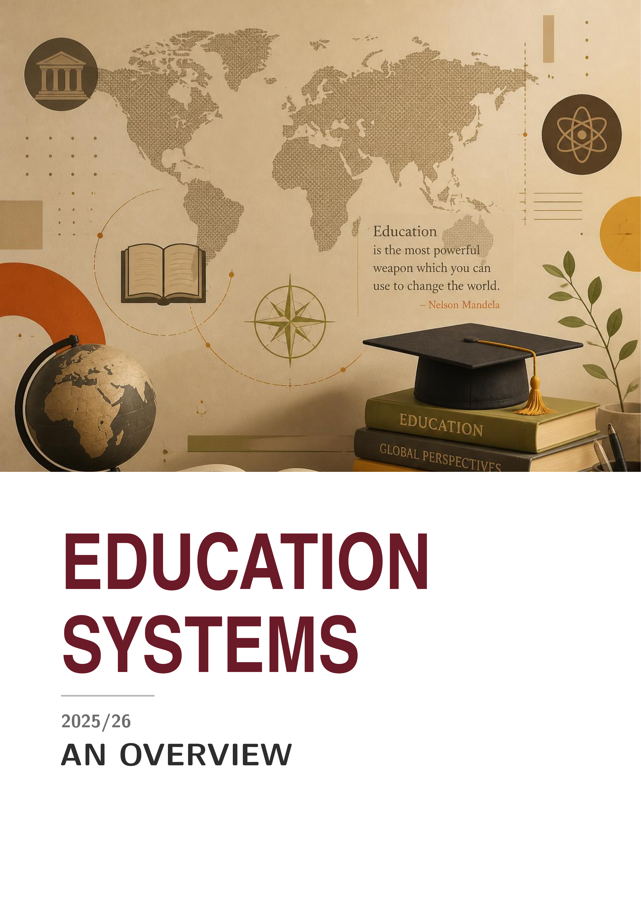
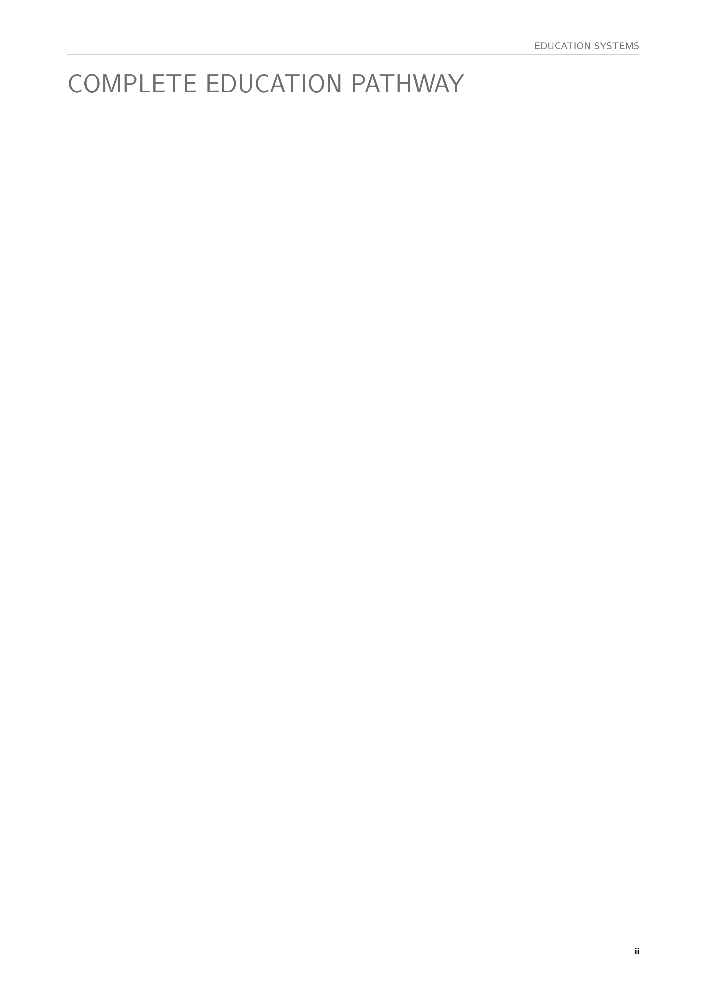
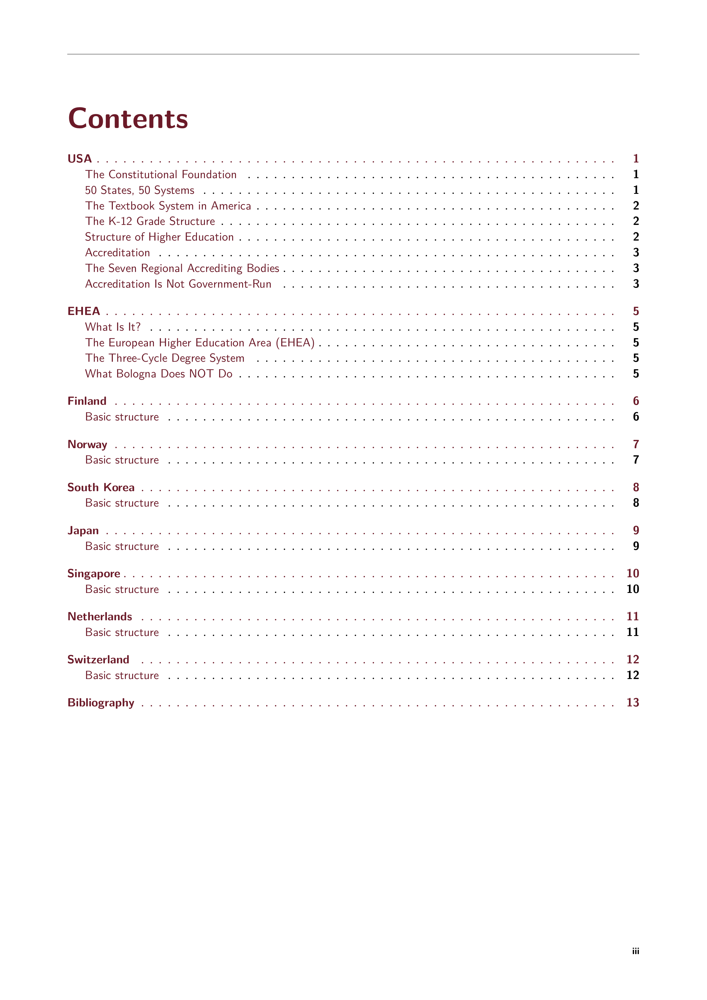
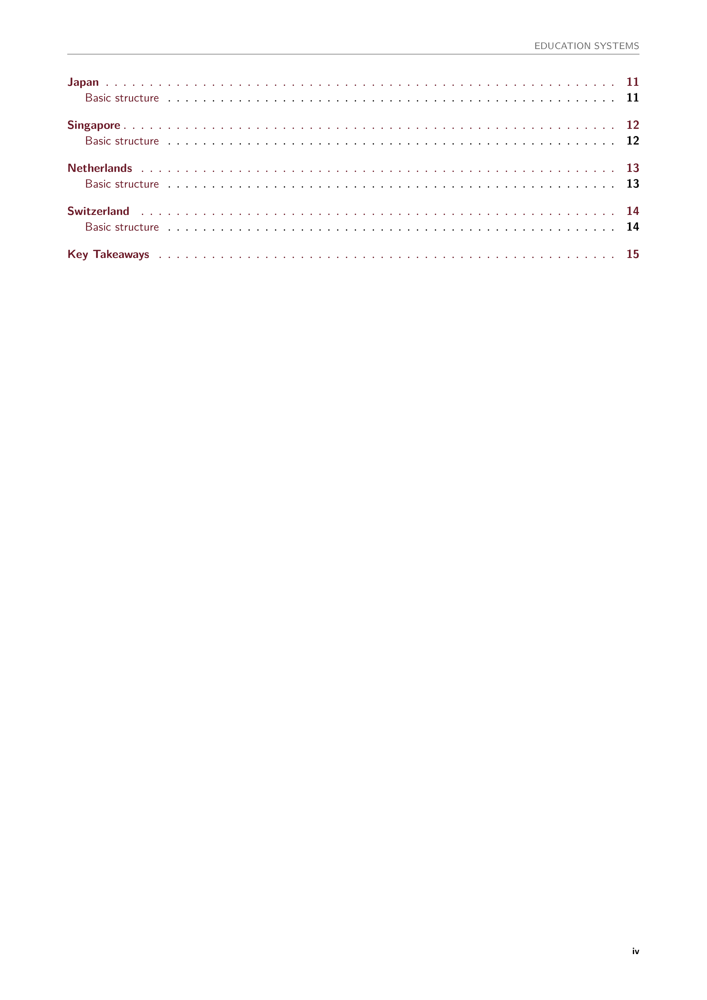
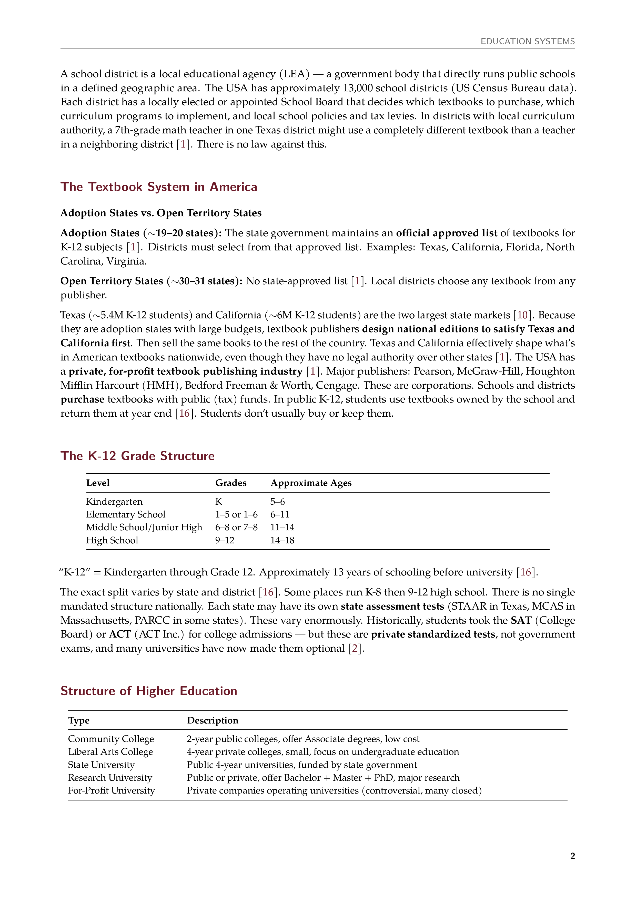
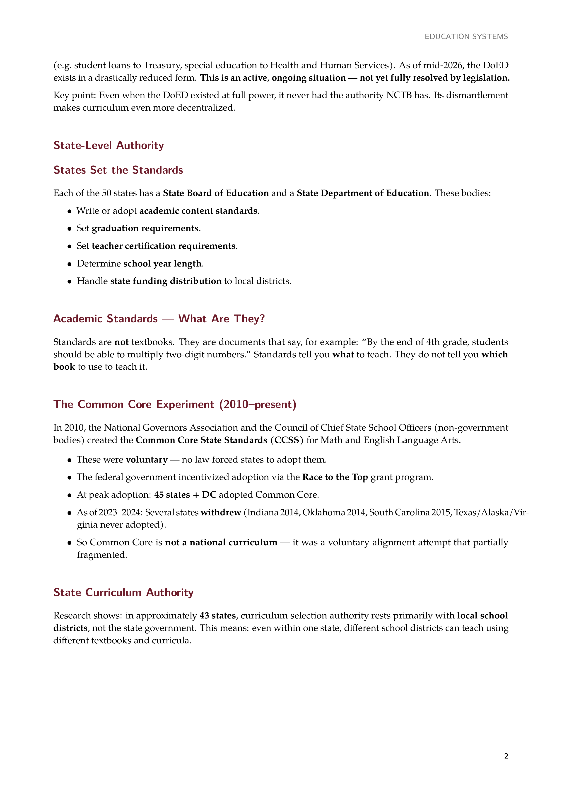
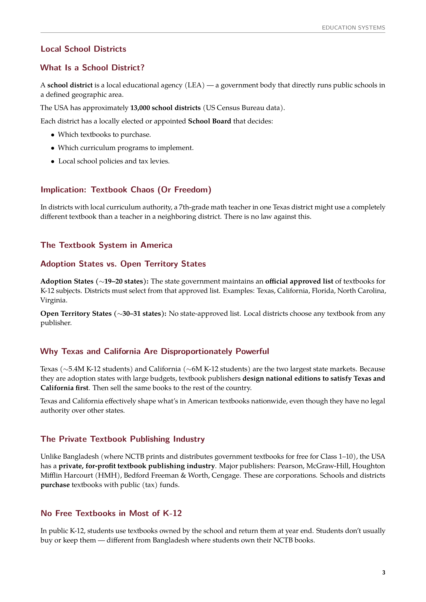
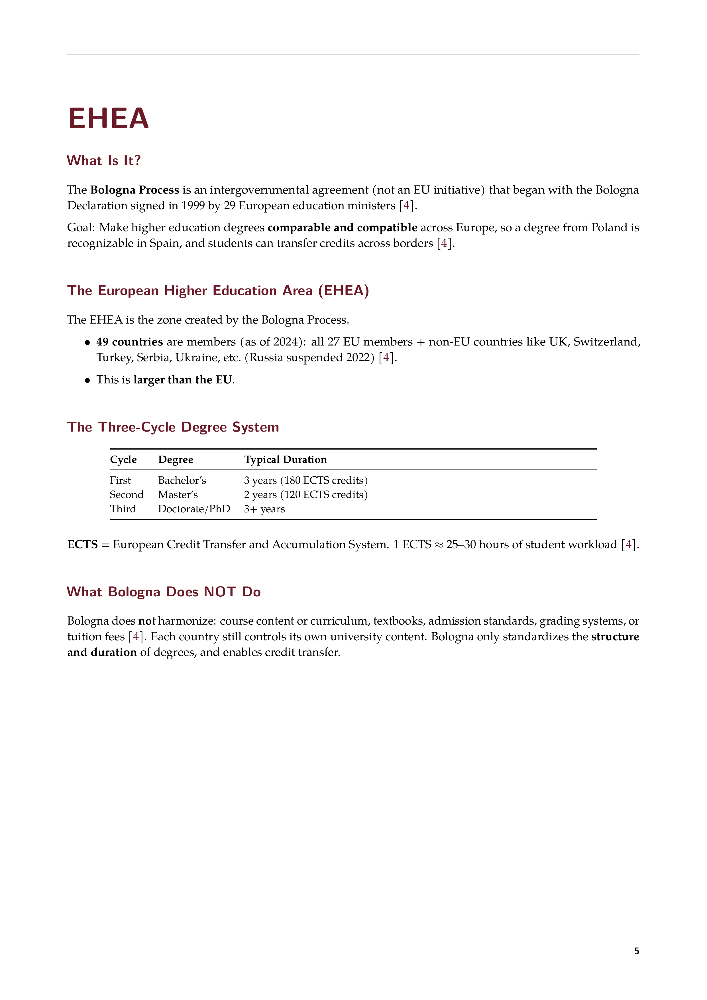

# Compendium

Structured knowledge documents in LaTeX.

---

## Education Systems: USA & Europe

A comprehensive comparative breakdown of K–12 and higher education systems across the United States and Europe. Covers constitutional foundations, federal/state authority structures, accreditation frameworks, and curriculum standards.

**Build Requirements:**
- LaTeX distribution with `latexmk` and `lualatex`
- TeX Gyre fonts (Pagella, Heros Condensed)

**Build:**
```bash
cd ed-sys
latexmk main.tex
```

**Live Preview:**
```bash
# Terminal 1: continuous compiler
latexmk -pvc main.tex

# Terminal 2: editor
hx main.tex

# Terminal 3: PDF viewer
zathura output/main.pdf
```

| | | | |
|---|---|---|---|
| [](assets/ed-sys-01.png) | [](assets/ed-sys-02.png) | [](assets/ed-sys-03.png) | [](assets/ed-sys-04.png) |
| [](assets/ed-sys-05.png) | [](assets/ed-sys-06.png) | [](assets/ed-sys-07.png) | [](assets/ed-sys-08.png) |
---

## License

No license. All rights reserved.
